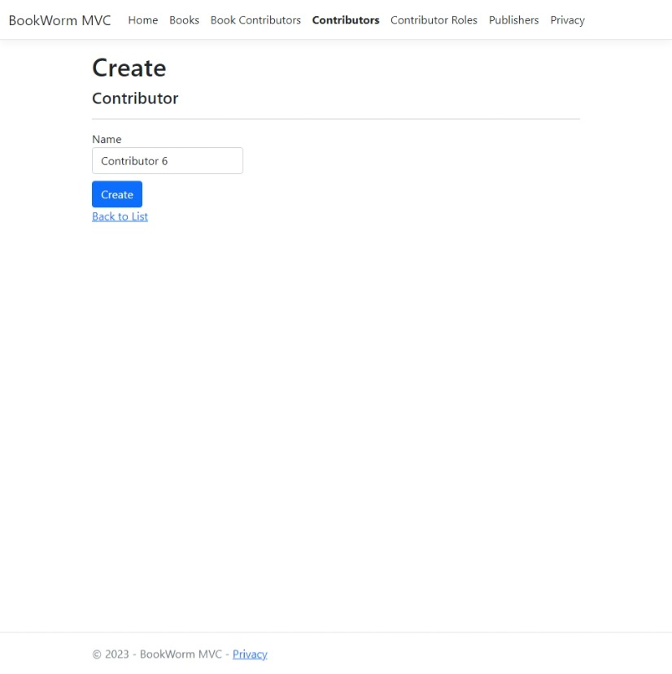
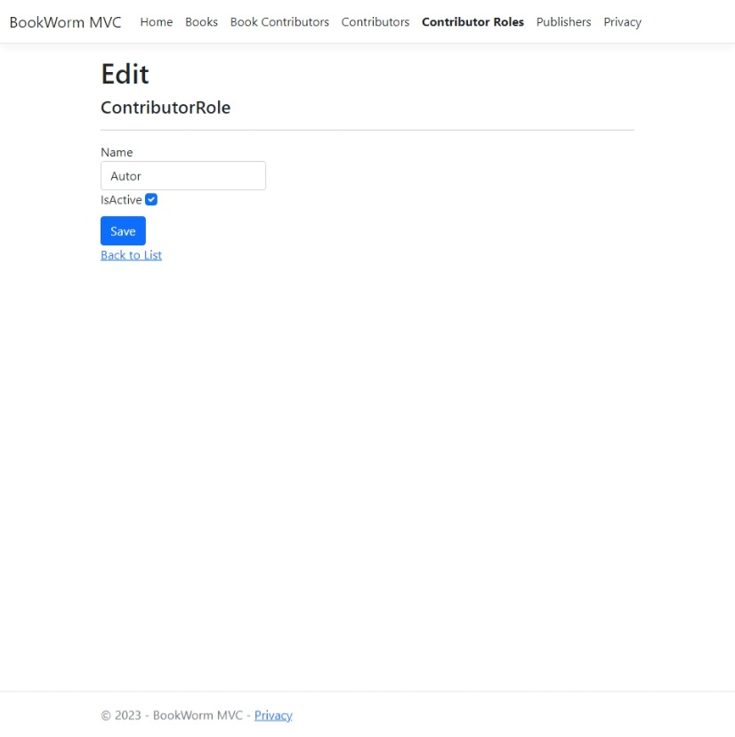

<div align="center">
    <h1>Book Worm MVC</h1>
    <h3>
        <a href="#quickstart">
            Quickstart
        </a>
        <span> | </span>
        <a href="https://github.com/chrisonoo/BookWormMVC">
            GitHub
        </a>
    </h3>
    <p> Simple manager for handling a list of books</p>
    <p><b>Status:</b> Project completed</p>
    <br>
    <p>Technologies and tools:</p>
    <p>
        
        
        
        
        
        
        
        
        
        
        
    </p>
</div>
<br>

<h2 id="table-of-contents">Table of Contents</h2>

- [Description](#description)
- [Quickstart](#quickstart)
- [Functionality](#functionality)
- [Database Schema (BookWormMVC)](#database-schema-bookwormmvc)
- [Feature List](#feature-list)
- [Technologies, Tools, Strategies and Programming Techniques](#technologies-tools-strategies-and-programming-techniques)
- [Dependencies](#dependencies)
- [Workflow](#workflow)
- [Summary](#summary)
- [Known Issues](#known-issues)
- [Contribution Guidelines](#contribution-guidelines)
- [License](#license)

## Description

BookWormMVC is an educational project created using **ASP.NET Core 6 MVC**, **C# 10** and **Entity Framework 7.0.x**. The main goal of the project was to understand and practically use the handling of `one-to-many` and `many-to-many` relationships in the database.

In the project, a **seeding approach** was employed, which involves populating the database with sample data. As a result, upon installation of the application, the user immediately has access to data that facilitates understanding of its functions and operation mechanisms. 

**Extensive documentation** helps to understand the project and draw your own conclusions for further learning.

## Quickstart

1. Open a terminal on your computer and navigate to the location where you want to download the application.
2. Run the command `git clone https://github.com/chrisonoo/BookWormMVC.git` and clone the application repository to the chosen folder on your disk.
3. Open the solution in Visual Studio 2022 and run <kbd>Build > Build Solution</kbd>.
4. Set the project **BookWorm.MVC** as the Startup Project.
5. Open <kbd>Tools > NuGet Package Manager > Package Manager Console</kbd>.
6. In the Package Manager Console, set <kbd>Default project: BookWorm.MVC</kbd>.
7. Type the command `add-migration Initial` in the Package Manager Console and execute it. This command will create a database migration file and perform seeding.
8. Type the command `update-database` in the Package Manager Console and execute it. This command will create a database and upload sample data into the local database.
9. Demo data will be uploaded to the database after the first launch of the application.

[[top](#table-of-contents)]

## Functionality

`BookWormMVC` is a simple book registration management system that allows for **CRUD** operations on a database created using the **code-first** approach. The application generates a database with appropriate relationships, and then through forms allows interaction with this database. Each table has dedicated controllers and views: Index, Edit, Details, Create, Delete.

In the application, a **soft delete** approach is used for deleting data in the Publishers, Contributor Roles, and Contributors tables. Thanks to this, no records are cascade deleted from the database. The application comes with a set of data that is added to the database during the first migration. This allows to test the application immediately after launch.

The main emphasis was placed on backend development, the frontend is the default ASP.NET template with minor CSS improvements and the implementation of bolding the active tab (controller) in the menu.

[[top](#table-of-contents)]

## Database Schema (BookWormMVC)


### Table: Books

**Description:** 

The `Books` table stores information about books available in the system. Each record represents one book.

**Fields:**

- **Id** (int): This is the primary key of the table. Each book has a unique identifier.
- **Title** (string): This field stores the title of the book.
- **PublicationYear** (int): This field stores the publication year of the book.
- **PublisherId** (int): This field stores the book's publisher identifier (foreign key).

**Relations:** 
- The `Books` table is related to the `Publishers` table by a **many-to-one** relationship. Many books can have the same publisher.
- The `Books` table is related to the `BookContributors` table by a **many-to-many** relationship. A book can have many contributors with roles, and a contributor with role can contribute to many books.

### Table: Publishers

**Description:**

The `Publishers` table stores information about publishers who contributed to the creation of books. Each record represents one publisher.

**Fields:**

- **Id** (int): This is the primary key of the table.
- **Name** (string): This field stores the name of the publisher.
- **IsActive** (bool): This field stores information about whether the publisher is deleted (soft delete).

**Relations:**

- The `Publishers` table is related to the `Books` table by a **one-to-many** relationship. A Publisher can contribute to many Books, and a Book can have only one Publisher.

### Table: Contributors

**Description:**

The `Contributors` table stores information about Contributors who contributed to the creation of Books. Each record represents one contributor.

**Fields:**

- **Id** (int): This is the primary key of the table.
- **Name** (string): This field stores the name of the contributor.
- **IsActive** (bool): This field stores information about whether the contributor is deleted (soft delete).

**Relations:**

- The `Contributors` table is related to the `BookContributors` table by a many-to-many relationship. A Contributor can contribute to many books, and a book can have many contributors.

### Table: Roles

**Description:**

The `Roles` table stores various roles that a contributor can take in the creation of a book. Each record represents one role.

**Fields:**

- **Id** (int): This is the primary key of the table.
- **Name** (string): This field stores the name of the role.

**Relations:** 

The `Roles` table is related to the `BookContributors` table by a many-to-many relationship. Each role can be assigned to many contributors, and a contributor can have many roles.

### Table: BookContributors

**Description:**

The `BookContributors` table is a junction (intermediate/associative) table between the `Books`, `Contributors`, `Roles` tables. Each record represents a relationship between a book and a contributor in a specific role.

**Fields:**

- `Primary key` is composed of three foreign keys: BookId, ContributorId, RoleId (composite primary key).
- **BookId** (int): This field is a foreign key referring to the `Books` table.
- **ContributorId** (int): This field is a foreign key referring to the `Contributors` table.
- **RoleId** (int): This field is a foreign key referring to the `Roles` table. It determines the role the contributor took in creating the book.

**Relations:**

- The `BookContributors` table is related to the `Books`, `Contributors` and `Roles` tables. Each relationship is defined by a unique set of three keys.


[[top](#table-of-contents)]

## Feature List

### Features for books:

<div align="center">


</div>

- Displaying a list of books
- Creating, editing, displaying details, deleting a single book

### Features for publishers:

<div align="center">


</div>

- Displaying a list of publishers
- Creating, editing, displaying details, deleting a single publisher
- Preview of the list of books published by the publisher

### Features for contributors:

<div align="center">




</div>

- Displaying a list of contributors
- Creating, editing, displaying details, deleting a single contributor

### Features for contributor roles:

<div align="center">





</div>

- Displaying a list of contributor roles
- Creating, editing, displaying details, deleting a single contributor role

### Features for book contributors:

<div align="center">


</div>

- Displaying a list of contributors and their roles in creating a book
- Creating, editing, displaying details, deleting a single book contributor

[[top](#table-of-contents)]

## Technologies, Tools, Strategies and Programming Techniques

- ASP.NET Core 6 MVC
- C# 10
- Entity Framework (utilizing both **Annotations** and **Fluent API**)
- Code First database and Seeding
- Automatic Resource Management with the **using** statement (during seeding)
- Soft Delete (tables: Contributors, Contributor Roles, Publishers)
- Hard Delete (tables: Books, Book Contributor)

[[top](#table-of-contents)]

## Dependencies

The project uses standard dependencies for **ASP.NET Core 6 MVC**:

- ASP.NET Core 6.0
- Microsoft.EntityFrameworkCore.SqlServer 7.0.9
- Microsoft.EntityFrameworkCore.Tools 7.0.9
- Microsoft.VisualStudio.Web.CodeGeneration.Design 6.0.15

[[top](#table-of-contents)]

## Workflow

```
⬜   - Task pending
⬜⏳ - Task in progress
✅   - Task completed
```

- [x] Plan the application project
    - [x] Define the goals of the application
    - [x] Define the features of the application
    - [x] Choose the technology and architecture of the application
    - [x] Design the database
    - [x] Design the UI/UX
    - [x] Plan the work and create a Workflow
- [x] Create solution in Visual Studio 2022
- [x] Add project ASP.NET Core 6 MVC to solution
- [x] Database, `code-first` approach
    - [x] Plan the Entity classes, incorporate the `soft-delete` strategy
    - [x] Adď the Entity classes
    - [x] Add Annotations and Fluent API configuration to the Entity classes
    - [x] Add Database configuration
    - [x] Add migration
    - [x] Update database
- [x] Add Controllers and Views
- [x] Add links to all controllers to the main menu
- [x] Adjust the Index and Privacy pages
- [x] Highlight active link in the menu
- [x] Correct CSS file with margin-top for primary button
- [x] Adjust the Publishers
    - [x] Change the description of the page from Index to Publishers in the `Publishers > Index` view.
    - [x] Add the display of the number of books published by the Publisher to the `Publishers > Index` view. Create class **PublisherViewModel**.
    - [x] Add the display of active and inactive Publishers in separate sections to the `Publishers > Index` view.
    - [x] Add editing of the IsActive field in the `Publisher > Edit` view.
    - [x] Add the display of the IsActive field in the `Publisher > Details` view.
    - [x] Add the display of books published by the Publisher to the `Publisher > Details` view.
    - [X] Adjust the `PublishersController.Delete` so that clicking <kbd>Delete</kbd> changes the IsActive field to false.
- [x] Adjust the Contributor Roles
    - [x] Change the description of the page from Index to Contributor Roles in the `Contributor Roles > Index` view.
    - [x] Add a column to display information from the IsActive field in the `Contributor Roles > Index` view.
    - [x] Add editing of the IsActive field in the `Contributor Roles > Edit` view.
    - [x] Add the display of the IsActive field in the `Contributor Roles > Details` view.
    - [X] Adjust the `ContributorRolesController.Delete` so that clicking <kbd>Delete</kbd> changes the IsActive field to false.
- [x] Adjust the Contributors
    - [x] Change the description of the page from Index to Contributors in the `Contributors > Index` view.
    - [x] Add a column to display information from the IsActive field in the `Contributors > Index` view.
    - [x] Add editing of the IsActive field in the `Contributors > Edit` view.
    - [x] Add the display of the IsActive field in the `Contributors > Details` view.
    - [X] Adjust the `ContributorsController.Delete` so that clicking <kbd>Delete</kbd> changes the IsActive field to false.
- [x] Adjust the Books
    - [x] Change the description of the page from Index to Books in the `Books > Index` view.
    - [x] Add the display of Publisher (foreign key) to the `Books > Index` view.
    - [x] Add the display of contributors in `Books > Details` view, with a division into Authors and other Contributors (many-to-many relationship).
- [x] Adjust the Book Contributors
    - [x] Change the description of the page from Index to Book Contributors in the `Book Contributors > Index` view.
- [x] Add demonstration data to the application (seeding).
- [x] Completion of project documentation
    - [x] Description
    - [x] Quickstart or/and Live Demo
    - [x] Functionality
    - [x] Database Schema
    - [x] Feature List
    - [x] Technologies, Tools, Strategies and Programming Techniques
    - [x] Dependencies
    - [x] Workflow
    - [x] Summary
    - [x] Known Issues
    - [x] Contribution Guidelines
    - [x] License

[[top](#table-of-contents)]

## Summary

The `BookWormMVC` project was not only a practical programming task, but also a valuable learning process in many areas. First and foremost, developing this project allowed for the adoption of **the methodology of dividing tasks into smaller**, more manageable pieces. This approach to task management contributed to **improving efficiency** and understanding the entire process of creating an application.

During the creation of the project, I also learned how important it is to **develop documentation**. Documentation is not only a necessary tool for other developers, but also a way to organize thoughts and better understand this project. Moreover, through the process of creating documentation, I learned to better **predict the consequences** of my design decisions, especially in the context of database architecture and ways of presenting this data in specific views.

Another important element of learning was **understanding the process of planning an application**. Planning is not just choosing technologies and tools, but also predicting potential problems, setting priorities, and making decisions that will shape the entire project.

[[top](#table-of-contents)]

## Known Issues

During the creation and testing of the `BookWormMVC` project, I noticed several issues that need to be addressed:

- [ ] **Several warnings about a possible null value**

    While coding and testing the project, I encountered **CS8602: Dereference of a possibly null reference warnings**. This is a potential source of errors during the application's operation, especially when this value is used in calculations or operations that are not prepared for null values.

- [ ] **Improperly designed table `BookContributors` connecting Books, Contributors, and their Roles**

    The table intended to link Books, Contributors, and their Roles was designed improperly. The primary key was set on three fields without any Id field, which greatly complicates editing, displaying details, and removing data. The search for the right position in the database occurs by giving an Id. As a result, handling these elements was not implemented.
    
- [ ] **Correct implementation of the `BookContributors` table**
    - [ ] To implement this functionality correctly, you need to add the Id field to the table.
    - [ ] In order to be able to add only one Contributor with a given Role to one Book, it is necessary to create appropriate business classes that verify this condition.
- [ ] Correct visibility and filter inactive Contributors and Contributor Roles
    - [ ] Create a filter in the `BookContributorsController` that filters out inactive Contributors in the `Book Contributors > Create` view.
    - [ ] Create a filter in the `BookContributorsController` that filters out inactive Contributor Roles in the `Book Contributors > Create` view.

These issues need attention and fixing to ensure that the application can operate smoothly.

[[top](#table-of-contents)]

## Contribution Guidelines

The project has been completed and will not be further developed, but any suggestions are welcome. Please open issues to share your feedback.

[[top](#table-of-contents)]

## License

This project is licensed under the MIT license.

[[top](#table-of-contents)]
